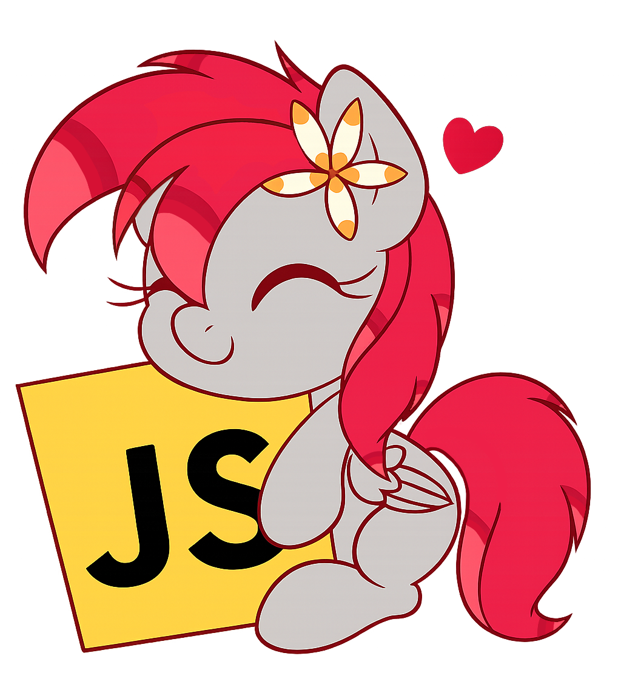

<div align="center">
   
   <br/>
   <a href="https://discord.gg/sSkysVtj7y"></a>
   <a href="https://www.patreon.com/JasminDreasond"></a>
   <a href="https://ko-fi.com/jasmindreasond"></a>

   [](https://github.com/Pony-Driland)
   [](https://twitter.com/JasminDreasond/)
   [](https://ud.me/jasmindreasond.x)
   [](https://www.blockchain.com/pt/btc/address/bc1qnk7upe44xrsll2tjhy5msg32zpnqxvyysyje2g)
</div>

# Tiny Pony Clipper

A lightweight, background clipping tool built with Electron and FFmpeg. Specifically optimized for Linux desktops (fully supporting both Wayland and X11), it constantly records a rolling buffer of your screen and saves the last few minutes instantly when a global shortcut is pressed.

## 🌟 Features

* **Wayland & X11 Support:** Uses native desktop portals for seamless screen capture on modern Linux environments.
* **Advanced Audio Routing:** Native PulseAudio/PipeWire integration. Record system audio and microphone into a single track, or split them into entirely separate audio tracks.
* **Smart Queue System:** Save multiple clips back-to-back. The background job dispatcher isolates the cache, allowing you to keep playing while FFmpeg processes the videos in parallel.
* **Highly Customizable:** Tweak FFmpeg parameters (codecs, presets, and quality commands) directly from the UI.

## 🛠️ Prerequisites

Tiny Pony Clipper relies on robust native Linux tools to handle audio and video processing. Ensure your system has the following packages installed:

* `ffmpeg` (for video encoding and assembly)
* `pulseaudio-utils` (provides `pactl` and `paplay` for audio device routing and notifications)
* `libnotify-bin` (for native system notifications)

On Ubuntu/Kubuntu/Debian systems, you can install them via:
```bash
sudo apt update
sudo apt install ffmpeg pulseaudio-utils libnotify-bin
```

## 🚀 How to Use

1.  **Launch the App:** Open Tiny Pony Clipper. It will quietly reside in your system tray.
2.  **Configure Your Hardware:** Click the tray icon to open the Settings window. Select your Desktop Sound output and your Microphone.
3.  **Set the Buffer:** Choose how many minutes of history you want to keep in the buffer.
4.  **Save a Clip:** While playing a game or working, press the designated shortcut (default is `F10` on Wayland environments). A notification will confirm that your clip is being processed and saved to your chosen directory\!

*Note for Wayland users: Due to Wayland's strict security protocols regarding global keyloggers, the application internally locks the capture shortcut to `F10`. Ensure your desktop environment passes this key to the application.*

## 📦 Installation (Pre-built)

Check the Releases page to download the latest files.

## 💻 How to Build from Source

To successfully compile the native addons in this project, you need to ensure your environment has the necessary build tools and global packages installed.

If you want to contribute, modify the code, or compile it yourself, follow these steps:

### 1- Clone the repository

```bash
git clone [https://github.com/JasminDreasond/Tiny-Pony-Clipper.git](https://github.com/JasminDreasond/Tiny-Pony-Clipper.git)
cd Tiny-Pony-Clipper
```

#### 1.1- System Prerequisites
Since `node-gyp` compiles C++ code, your system must have a C++ compiler and Python installed.

#### 1.2- Global Node.js Dependencies
You will need `node-gyp` to handle the native build configurations and `yarn` for package management:

```bash
npm install -g node-gyp yarn
```

#### 1.3- Running the Build
Once the dependencies are met, you can trigger the configuration and compilation process:

```bash
npx node-gyp configure build
```

#### 2- Install Node.js dependencies

```bash
yarn
```

### 3- Run in development mode

```bash
yarn start
```

### 4- Build the Linux installers (.deb, .AppImage, .tar.gz)

```bash
yarn build:linux
```

*The compiled binaries will be available in the `dist/` folder.*

## 💖 Contributing

Contributions, bug reports, and pull requests are always welcome\! If this tool helps you capture your best moments, consider starring the repository or supporting the project to help keep the development active.

---

## 💡 Credits

> 🧠 **Note**: This documentation was written by [Gemini](https://gemini.google.com), an AI assistant developed by Google, based on the project structure and descriptions provided by the repository author.  
> If you find any inaccuracies or need improvements, feel free to contribute or open an issue!

<div align="center">
<a href="https://github.com/Tiny-Essentials/Tiny-Essentials/tree/main/test/img"></a>

Made with tiny love! 🍮
</div>
